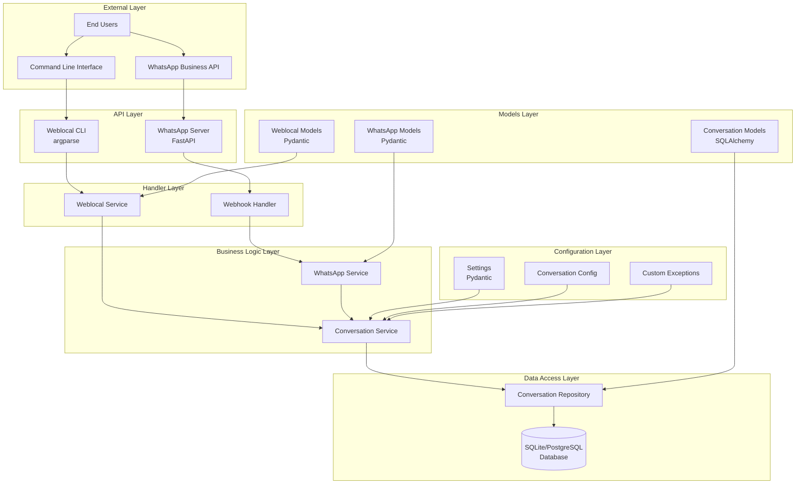
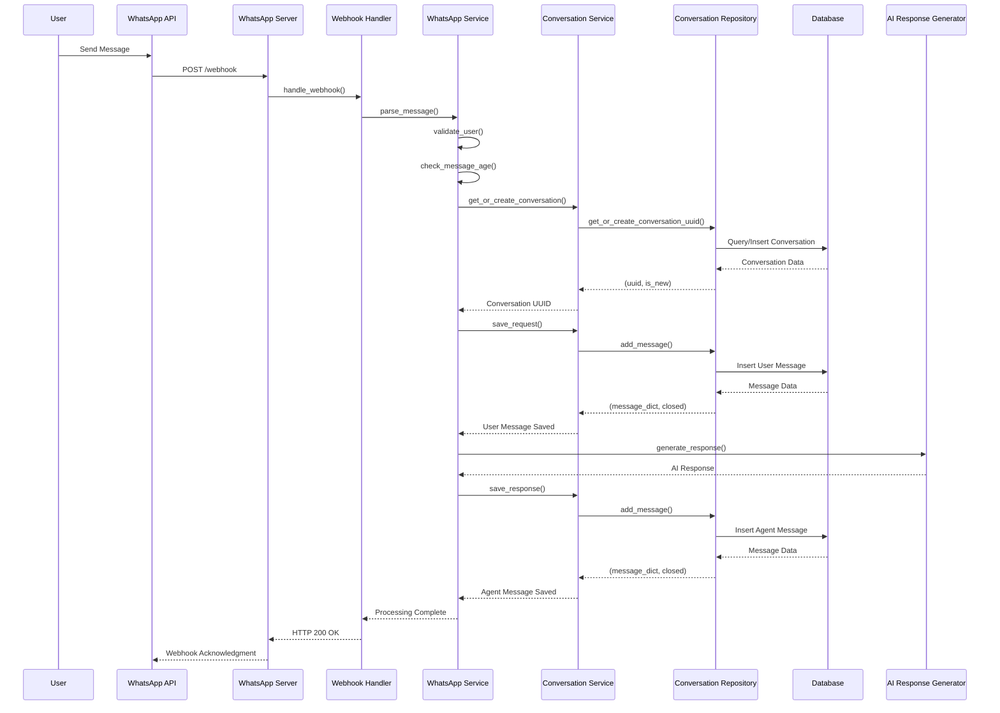
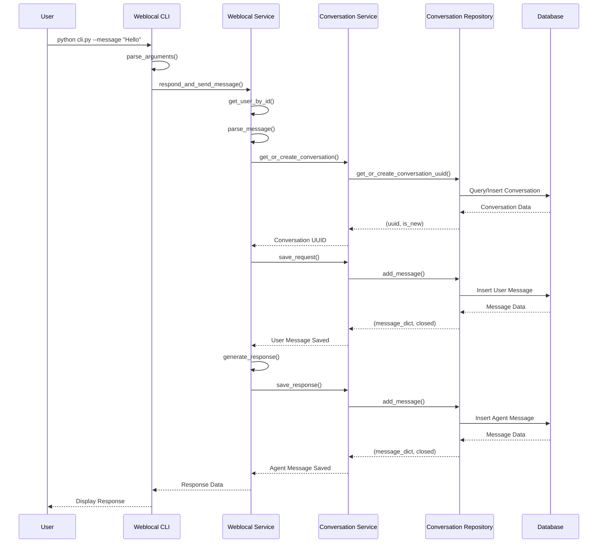
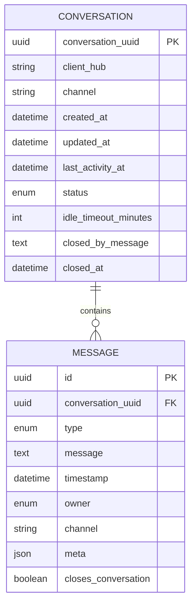
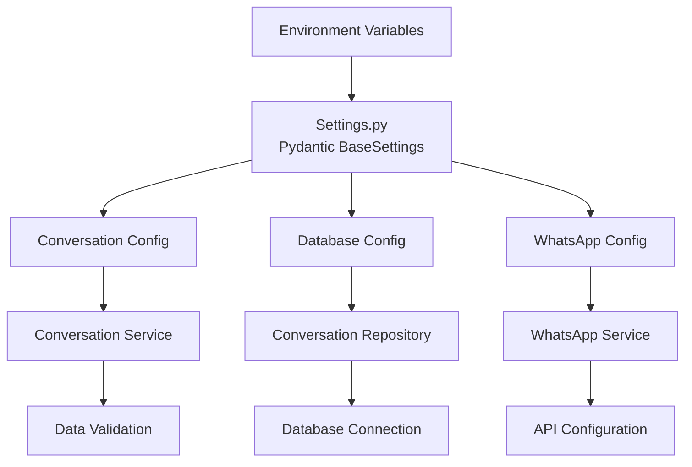
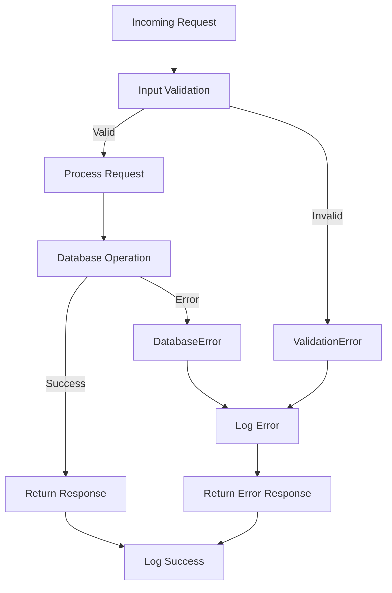
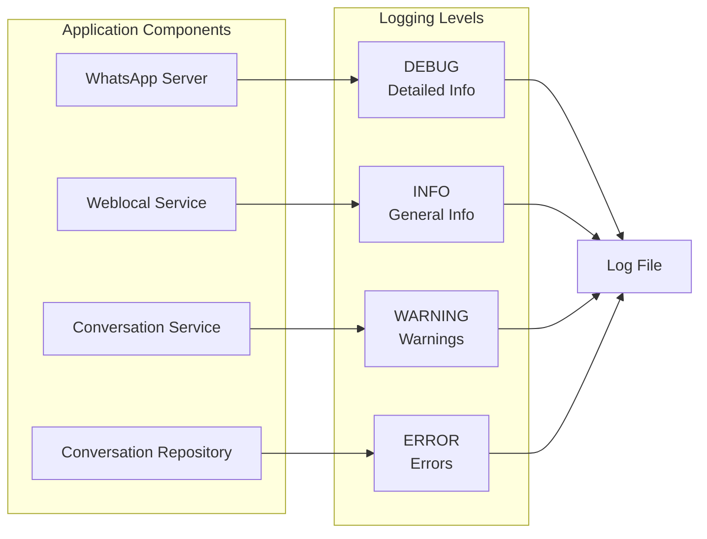
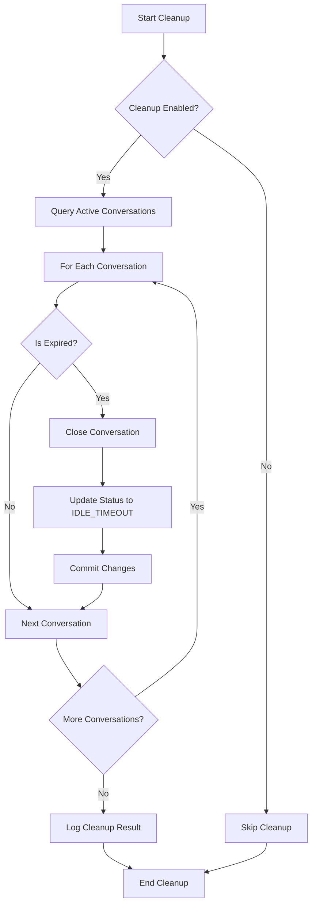
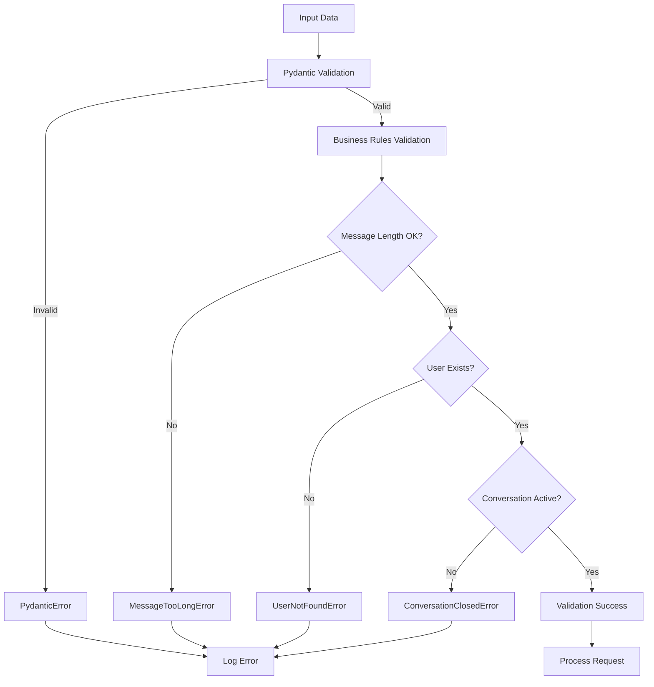

# 🏗️ Arquitetura Detalhada - Conversation Service

Este documento contém diagramas detalhados da arquitetura do sistema.

## 📊 Diagramas de Arquitetura

### 1. Arquitetura Geral do Sistema



### 2. Fluxo de Processamento de Mensagem WhatsApp



### 3. Fluxo de Processamento Local (CLI)



### 4. Estrutura de Dados



### 5. Padrões de Design Implementados

```mermaid
graph LR
    subgraph "Factory Pattern"
        SF[ServiceFactory]
        WSF[WeblocalServiceFactory]
        SF --> WS[WhatsApp Service]
        SF --> CS[Conversation Service]
        WSF --> WLS[Weblocal Service]
        WSF --> CS2[Conversation Service]
    end
    
    subgraph "Repository Pattern"
        CR[Conversation Repository]
        CS3[Conversation Service]
        CR --> DB[(Database)]
        CS3 --> CR
    end
    
    subgraph "Strategy Pattern"
        CH[Channel Interface]
        WS2[WhatsApp Service]
        WLS2[Weblocal Service]
        CH <|-- WS2
        CH <|-- WLS2
    end
    
    subgraph "Configuration Pattern"
        SETTINGS[Settings]
        CONFIG[Conversation Config]
        SETTINGS --> CONFIG
    end
```

### 6. Fluxo de Configuração



### 7. Tratamento de Erros



### 8. Sistema de Logging



### 9. Fluxo de Cleanup de Conversas



### 10. Validação de Dados



## 🔧 Componentes Técnicos

### Tecnologias Utilizadas

- **FastAPI**: Framework web moderno e rápido
- **SQLAlchemy**: ORM para Python
- **Pydantic**: Validação de dados e configurações
- **SQLite/PostgreSQL**: Banco de dados
- **Uvicorn**: Servidor ASGI
- **Python 3.8+**: Linguagem de programação

### Padrões de Arquitetura

1. **Layered Architecture**: Separação em camadas
2. **Repository Pattern**: Abstração de acesso a dados
3. **Factory Pattern**: Criação de objetos
4. **Strategy Pattern**: Diferentes implementações de canais
5. **Configuration Pattern**: Configurações centralizadas
6. **Exception Handling**: Tratamento específico de erros

### Princípios SOLID

- **S**: Single Responsibility - Cada classe tem uma responsabilidade
- **O**: Open/Closed - Aberto para extensão, fechado para modificação
- **L**: Liskov Substitution - Substituição de implementações
- **I**: Interface Segregation - Interfaces específicas
- **D**: Dependency Inversion - Dependência de abstrações

---

Este documento fornece uma visão detalhada da arquitetura do sistema, facilitando a compreensão e manutenção do código.
