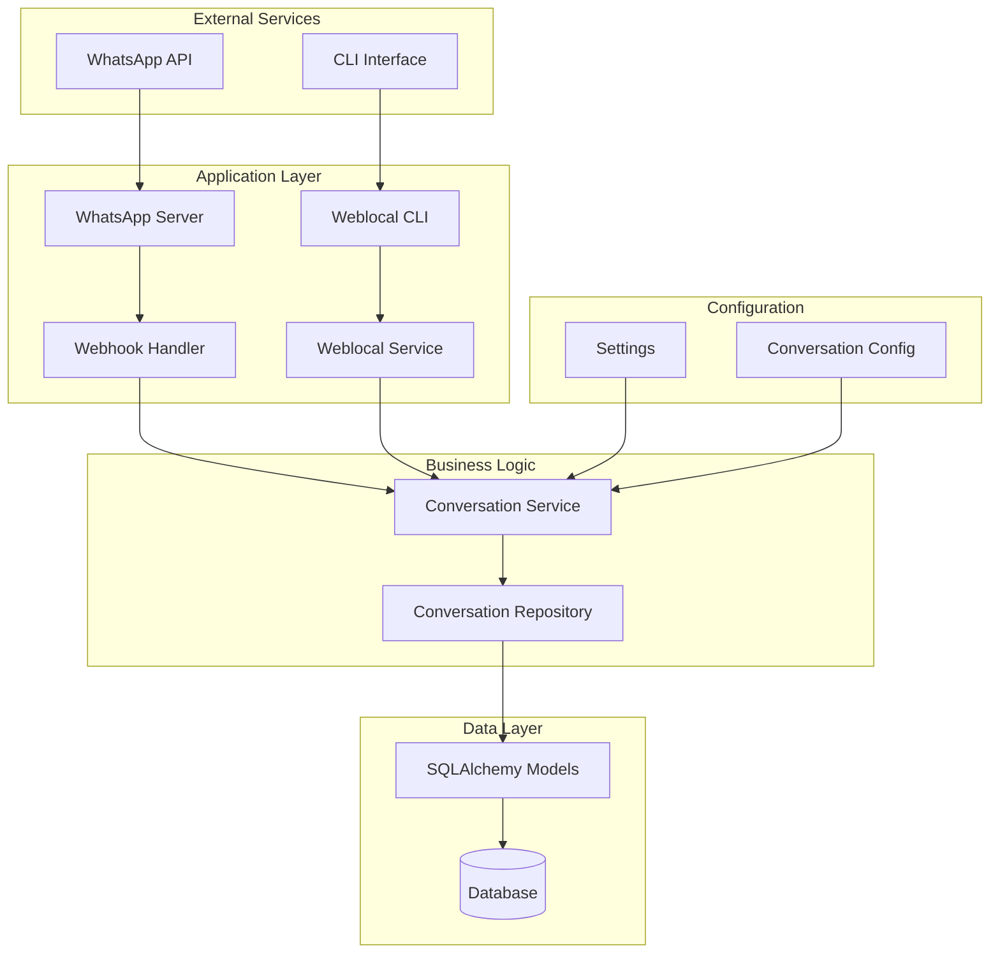
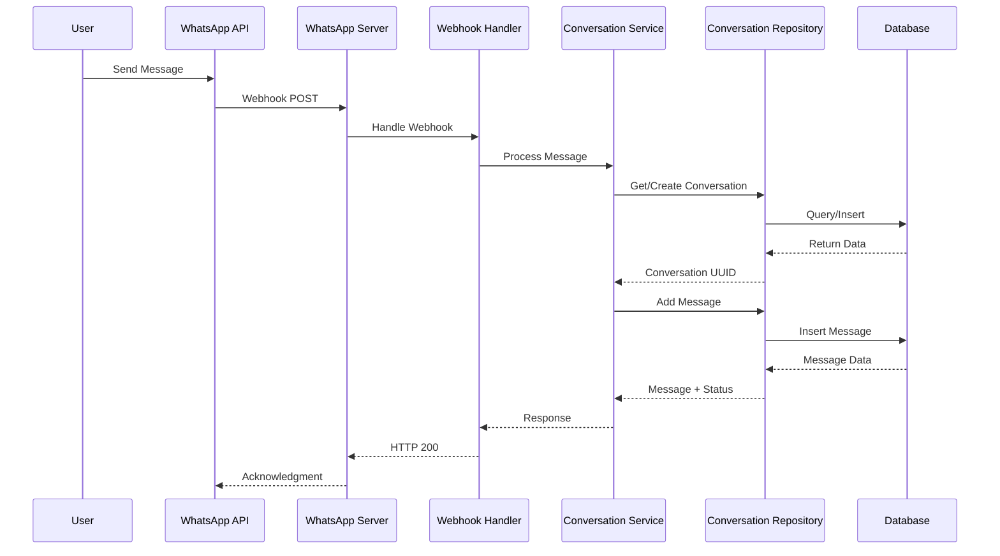

# 🤖 Conversation Service

Sistema de gerenciamento de conversas multi-canal com suporte a WhatsApp e interface local, construído com FastAPI, SQLAlchemy e arquitetura modular.

## 📋 Índice

- [Visão Geral](#-visão-geral)
- [Arquitetura](#-arquitetura)
- [Módulos](#-módulos)
- [Instalação](#-instalação)
- [Configuração](#-configuração)
- [Uso](#-uso)
- [API Endpoints](#-api-endpoints)
- [Estrutura do Projeto](#-estrutura-do-projeto)
- [Desenvolvimento](#-desenvolvimento)
- [Contribuição](#-contribuição)

## 🎯 Visão Geral

O Conversation Service é uma plataforma robusta para gerenciamento de conversas que oferece:

- **Multi-canal**: Suporte a WhatsApp e interface local
- **Persistência**: Banco de dados SQLite/PostgreSQL com SQLAlchemy
- **Arquitetura Modular**: Separação clara de responsabilidades
- **Configuração Centralizada**: Gerenciamento via variáveis de ambiente
- **Logging Estruturado**: Monitoramento e debugging avançado
- **Validação Robusta**: Tratamento de erros e validações específicas
- **CLI Avançado**: Interface de linha de comando para testes e operações

## 🏗️ Arquitetura

### Diagrama de Arquitetura Geral



### Fluxo de Dados



## 📦 Módulos

### 1. **WhatsApp Module** (`whatsapp/`)
Gerencia integração com WhatsApp Business API.

**Componentes:**
- `server.py`: FastAPI endpoints e roteamento
- `webhook_handler.py`: Lógica de processamento de webhooks
- `whatsapp_service.py`: Serviço principal de WhatsApp
- `whatsapp_models.py`: Modelos Pydantic para WhatsApp
- `dependencies.py`: Factory pattern para injeção de dependências

**Funcionalidades:**
- ✅ Verificação de webhook
- ✅ Processamento de mensagens (texto, áudio, imagem)
- ✅ Validação de usuários autorizados
- ✅ Tratamento de mensagens expiradas
- ✅ Logging estruturado

### 2. **Weblocal Module** (`weblocal/`)
Interface local para testes e desenvolvimento.

**Componentes:**
- `weblocal_service.py`: Serviço principal local
- `weblocal_tester.py`: Testes automatizados
- `cli.py`: Interface de linha de comando
- `builders.py`: Construtores de payload
- `models.py`: Modelos para interface local
- `dependencies.py`: Factory pattern para dependências

**Funcionalidades:**
- ✅ Chat interativo
- ✅ Testes automatizados
- ✅ CLI avançado com argumentos
- ✅ Estatísticas de conversas
- ✅ Histórico de mensagens

### 3. **Conversation Module** (`conversation/`)
Núcleo do sistema de gerenciamento de conversas.

**Componentes:**
- `service.py`: Camada de serviço
- `repository.py`: Camada de acesso a dados
- `models.py`: Modelos SQLAlchemy
- `db.py`: Configuração de banco de dados
- `config.py`: Configurações específicas
- `exceptions.py`: Exceções customizadas

**Funcionalidades:**
- ✅ Criação e gerenciamento de conversas
- ✅ Timeout automático de conversas
- ✅ Histórico de mensagens
- ✅ Estatísticas e métricas
- ✅ Cleanup de conversas antigas
- ✅ Validação robusta de dados

### 4. **Channel Module** (`channel/`)
Interface abstrata para diferentes canais de comunicação.

**Componentes:**
- `channel.py`: Classe abstrata base

### 5. **Config Module** (`config/`)
Gerenciamento centralizado de configurações.

**Componentes:**
- `settings.py`: Configurações via Pydantic BaseSettings

## 🚀 Instalação

### Pré-requisitos

- Python 3.8+
- pip
- Git

### Instalação

```bash
# Clone o repositório
git clone <repository-url>
cd conversation_service

# Instale as dependências
pip install -r requirements.txt

# Configure as variáveis de ambiente
cp .env.example .env
# Edite o arquivo .env com suas configurações
```

## ⚙️ Configuração

### Variáveis de Ambiente

Crie um arquivo `.env` na raiz do projeto:

```env
# WhatsApp Configuration
VERIFICATION_TOKEN=your_verification_token
WHATSAPP_API_TOKEN=your_whatsapp_api_token
MY_BUSINESS_TELEPHONE=your_business_phone

# Server Configuration
HOST=0.0.0.0
PORT=5001
DEBUG=true
IS_DEV_ENVIRONMENT=true

# Database Configuration
DATABASE_PATH=conversations.db
DB_TYPE=sqlite

# Conversation Configuration
CONVERSATION_IDLE_TIMEOUT_MINUTES=2
MAX_MESSAGE_LENGTH=4000
CLEANUP_DAYS_OLD=30
CLEANUP_BATCH_SIZE=100
MAX_CONVERSATION_HISTORY=1000
ENABLE_CLEANUP_ON_OPERATION=false
```

### Usuários Autorizados

Configure os usuários autorizados no arquivo `allowed_users.json`:

```json
[
  {
    "id": 1,
    "phone": "+5511999999999",
    "first_name": "Teste",
    "last_name": "Usuario",
    "email": "teste@exemplo.com"
  }
]
```

## 🎮 Uso

### 1. Iniciar o Servidor WhatsApp

```bash
# Desenvolvimento
uvicorn whatsapp.server:app --host 0.0.0.0 --port 5001 --reload

# Produção
uvicorn whatsapp.server:app --host 0.0.0.0 --port 5001
```

### 2. Usar o CLI Local

```bash
# Enviar mensagem
python weblocal/cli.py --message "Olá, teste!" --user user_123

# Ver estatísticas
python weblocal/cli.py --stats

# Ver histórico
python weblocal/cli.py --history --user user_123 --limit 10

# Chat interativo
python weblocal/cli.py --interactive --user user_123

# Ajuda
python weblocal/cli.py --help
```

### 3. Executar Testes

```bash
# Teste simples
python weblocal/weblocal_tester.py

# Teste completo
python weblocal/weblocal_tester.py

# Teste WhatsApp
python whatsapp/whatsapp_tester.py message "Test message"
```

## 🔌 API Endpoints

### WhatsApp Webhook

```http
GET /webhook
```
Verifica o webhook do WhatsApp.

**Parâmetros:**
- `hub.mode`: "subscribe"
- `hub.challenge`: Número de desafio
- `hub.verify_token`: Token de verificação

```http
POST /webhook
```
Recebe mensagens do WhatsApp.

**Body:** Payload do WhatsApp Business API

### Health Check

```http
GET /health
```
Verifica se o serviço está funcionando.

```http
GET /readiness
```
Verifica se o serviço está pronto para receber requisições.

### Documentação da API

- **Desenvolvimento**: `http://localhost:5001/docs`
- **ReDoc**: `http://localhost:5001/redoc`

## 📁 Estrutura do Projeto

```
conversation_service/
├── 📁 channel/                 # Interface abstrata para canais
│   ├── __init__.py
│   └── channel.py
├── 📁 config/                  # Configurações centralizadas
│   ├── __init__.py
│   └── settings.py
├── 📁 conversation/            # Núcleo do sistema
│   ├── __init__.py
│   ├── config.py              # Configurações específicas
│   ├── db.py                  # Configuração de banco
│   ├── exceptions.py          # Exceções customizadas
│   ├── models.py              # Modelos SQLAlchemy
│   ├── repository.py          # Camada de dados
│   └── service.py             # Camada de serviço
├── 📁 weblocal/               # Interface local
│   ├── __init__.py
│   ├── builders.py            # Construtores de payload
│   ├── cli.py                 # Interface CLI
│   ├── dependencies.py        # Factory pattern
│   ├── helpers.py             # Funções auxiliares
│   ├── models.py              # Modelos locais
│   ├── weblocal_service.py    # Serviço principal
│   └── weblocal_tester.py     # Testes automatizados
├── 📁 whatsapp/               # Integração WhatsApp
│   ├── __init__.py
│   ├── dependencies.py        # Factory pattern
│   ├── server.py              # Servidor FastAPI
│   ├── webhook_handler.py     # Processamento de webhooks
│   ├── whatsapp_models.py     # Modelos WhatsApp
│   ├── whatsapp_service.py    # Serviço principal
│   └── whatsapp_tester.py     # Testes WhatsApp
├── 📄 allowed_users.json      # Usuários autorizados
├── 📄 conversations.db        # Banco SQLite
├── 📄 requirements.txt        # Dependências Python
├── 📄 use.txt                 # Instruções de uso
└── 📄 README.md               # Este arquivo
```

## 🔧 Desenvolvimento

### Padrões de Código

- **Factory Pattern**: Para injeção de dependências
- **Repository Pattern**: Para acesso a dados
- **Service Layer**: Para lógica de negócio
- **Configuration Pattern**: Para configurações centralizadas
- **Exception Handling**: Exceções específicas e informativas

### Logging

O sistema usa logging estruturado em todos os módulos:

```python
import logging
logger = logging.getLogger(__name__)

# Diferentes níveis
logger.debug("Informação detalhada")
logger.info("Informação geral")
logger.warning("Aviso")
logger.error("Erro")
```

### Testes

```bash
# Testar módulo weblocal
python weblocal/weblocal_tester.py

# Testar módulo whatsapp
python whatsapp/whatsapp_tester.py message "Test"

# Testar CLI
python weblocal/cli.py --message "Test" --user test_user
```

### Validação de Dados

O sistema usa Pydantic para validação:

```python
from pydantic import BaseModel, Field

class MessageData(BaseModel):
    message: str
    type: str
    timestamp: datetime = Field(default_factory=datetime.now)
```

## 📊 Monitoramento

### Logs Estruturados

- **Inicialização**: Logs de configuração e conexão
- **Operações**: Logs de criação/recuperação de conversas
- **Performance**: Tempo de processamento
- **Erros**: Contexto detalhado de falhas

### Métricas Disponíveis

- Total de conversas
- Conversas ativas
- Conversas encerradas por timeout
- Conversas encerradas por agente
- Média de mensagens por conversa

## 🤝 Contribuição

### Como Contribuir

1. Fork o projeto
2. Crie uma branch para sua feature (`git checkout -b feature/AmazingFeature`)
3. Commit suas mudanças (`git commit -m 'Add some AmazingFeature'`)
4. Push para a branch (`git push origin feature/AmazingFeature`)
5. Abra um Pull Request

### Padrões de Commit

```
feat: adiciona nova funcionalidade
fix: corrige bug
docs: atualiza documentação
style: formatação de código
refactor: refatoração de código
test: adiciona ou corrige testes
chore: tarefas de manutenção
```

## 📄 Licença

Este projeto está sob a licença MIT. Veja o arquivo `LICENSE` para mais detalhes.

## 🆘 Suporte

Para suporte e dúvidas:

1. Verifique a documentação
2. Consulte os logs do sistema
3. Execute os testes para verificar funcionamento
4. Abra uma issue no repositório

---

**Desenvolvido com ❤️ usando FastAPI, SQLAlchemy e Python**